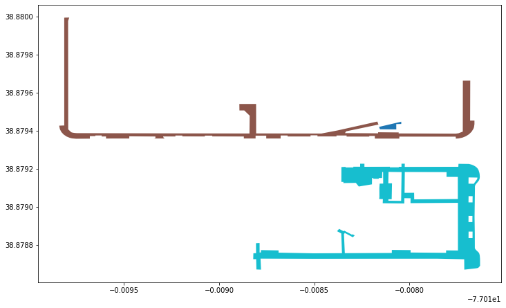
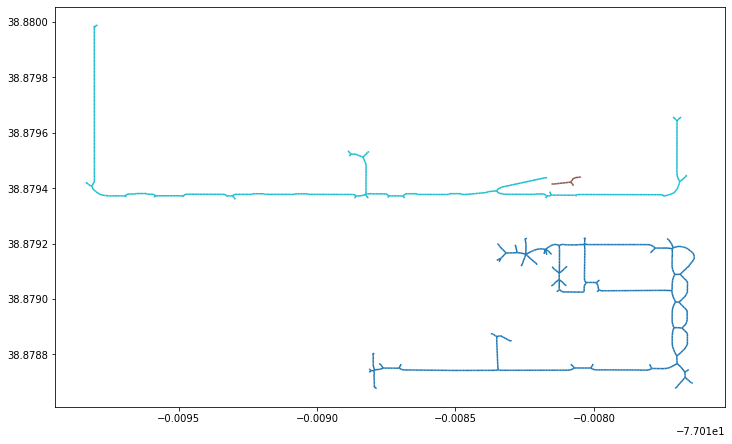
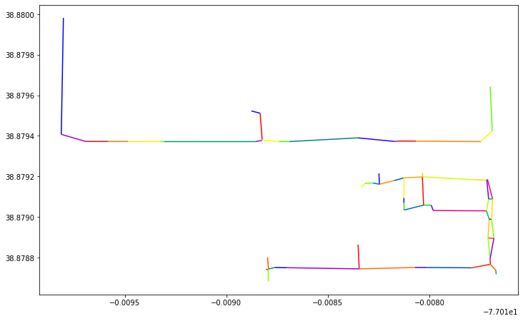

# Sidewalk Widths DC

Inspired by [Sidewalk Widths NYC](https://github.com/meliharvey/sidewalkwidths-nyc)

Sidewalk Widths DC uses [Washington DC's](https://opendata.dc.gov/datasets/sidewalks) to produce a map of sidewalk widths for the District.

This repo contains the notebooks to reproduce this work, as well as the finished Sidewalk Width dataset in GeoJSON format.

## Link
[www.sidewalkwidths.dc](http://www.sidewalkwidths.dc)

## Methodology

1) Polygons from DC open data

1) Dissolve adjacent sidewalk polygons

2) Find sidewalk centerlines

3) Remove short ends and simplify

4) Measure distance from centerlines to original polygon

